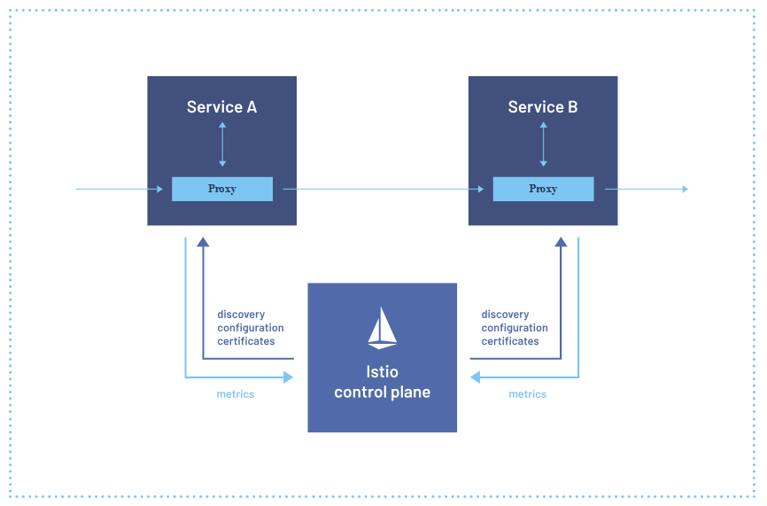

# Introduction to Istio

## Challenges of Microservices
The main challenges posed by the microservices cloud native architecture are:
- Service discovery
- Load balancing
- Service call handling
- Resilience
- Security
- Diagnosis and troubleshooting
- Resource utilization
- Automated testing
- Traffic management

## Service Meshes
> Service Mesh attepmts to solve the challenges mention above by bundling the infrustructure capabilities out side of the application. The application should only contain the implementation of the business logic.
With this approach, every service in a distributed system would be accompanied by a dedicated proxy running out-of-process. Requests in and out of a given application are routed through its proxy.

The proxy can perform:
- Retry on failed requests
- Network timeouts, and circuit-breaking logic
- Client-side load balancing requests
- Encrypted traffic with mutual TLS
- Act as a security gateway, also known as a Policy Enforcement Point.

The Istio control plane automates the configuration and synchronization of proxies deployed onto Kubernetes as sidecars inside each Pod.

*The Istio Architecture, in a nutshell*

Istio's main functions are:
1. Ensuring that each time a workload is deployed, an Envoy sidecar is deployed alongside it.
2. Ensuring traffic into and out of the application is transparently diverted through the proxy.
3. Assigning each workload a cryptographic identity as the basis for a more secure computing environment.
4. Configuring the proxies with all the information they need to handle incoming and outgoing traffic.

The job of configuring the proxies with all the information they need to handle both incoming and outgoing traffic falls to the Istio control plane. That is, Istio automates the configuration of all sidecars in the mesh to do their job of routing traffic according to a defined network policy, security policy, routing policy.

Envoy has the ability to receive configuration updates via API and to reload its configuration "live", without requiring a restart. This API is known as Envoy's discovery API, often abbreviated xDS.

Istio is then the control plane that continuously pushes configuration updates to sidecars each time the mix or number of services in the mesh changes, or each time we update policies that affect the mesh.

Istio modifies Kubernetes deployment manifests to include sidecars with each pod in two ways:
- Manual sidecar injection
- Automatic sidecar injection: we add annotation application of the label istio-injection=enabled to the deployment template manifiest.

Routing Application Traffic Through the Sidecar or proxy is performed by applying **iptables** rules. The sidecar injection process injects a Kubernetes **init container** in addition to the Envoy sidecar. The init-container applies these iptables rules before the Pod containers are started.

 The **init containers**, which are specialized containers that run before app containers in a Pod. Init containers can contain utilities or setup scripts not present in an app image.

Today Istio provides two alternative mechanisms for configuring a Pod to allow Envoy to intercept requests. 
1. The original iptables method, and 
2. The Kubernetes CNI plugin

